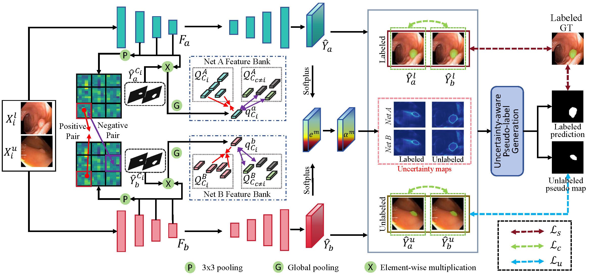

# UC-Seg: Uncertainty-Aware Cross-Training for Semi-Supervised Medical Image Segmentation

[](https://ieeexplore.ieee.org/document/xxxxxxx)
[](https://opensource.org/licenses/MIT)

This repository hosts the official PyTorch implementation of the **UC-Seg** framework, a novel approach designed to enhance semi-supervised medical image segmentation through uncertainty-aware cross-training, as presented in our **IEEE Transactions on Image Processing (TIP) 2025** paper.

---

## 📌 Overview

Semi-supervised Medical Image Segmentation (SMIS) has gained considerable popularity due to its capability to reduce reliance on expert-annotated data. However, existing dual-stream and mean-teacher methods often suffer from severe cognitive biases and struggle to generate high-confidence pseudo-labels from perturbed inputs. **UC-Seg** addresses these critical challenges by incorporating two distinct structural subnets to effectively explore their correlation and mitigate internal biases.

The framework significantly improves segmentation accuracy through two key components:

* **Cross-subnet Consistency Preservation (CCP):** Employs an Intra-subnet Feature Enhancement (IFE) strategy based on contrastive learning to enhance discriminative feature representations, alongside an Inter-subnet Consistency (IC) strategy to align feature embeddings across the subnets. This ensures that each subnet can correct its own biases and learn shared semantics from both labeled and unlabeled data.
* **Uncertainty-aware Pseudo-label Generation (UPG):** Integrates the segmentation results and their corresponding Dirichlet distribution-based uncertainty maps from both subnets to adaptively generate high-confidence pseudo-labels. This strategy effectively circumvents the necessity for preset thresholds and prevents subnets from being trapped in incorrect predictions.

---

## 🏗️ Methodology

The UC-Seg framework facilitates robust mutual feature learning between two subnets and enhances the reliability of pseudo-labels through subjective logic-based uncertainty estimation.

<p align="center">
  
</p>
<p align="center">
  <em>Figure 1: The overall architecture of the proposed UC-Seg framework.</em>
</p>

---

## 📁 Repository Structure

The repository is organized into distinct directories for 2D and 3D segmentation tasks. The detailed structure is as follows:

```text
UCSeg/
├── UC-Seg_2D_github/           # Implementation for 2D medical image segmentation tasks
│   ├── dataloader/            
│   ├── module/                
│   ├── utils/                  
│   ├── UC_trainer.py           
│   ├── UC_trainer_ACDC.py      
│   ├── prediction.py           # Inference script for standard 2D datasets
│   ├── prediction_ACDC.py      # Inference script for ACDC
│   ├── train.py                # Main execution script for 2D training
│   └── train_ACDC.py           # Main execution script for ACDC training
├── UC-Seg_3D_github/           # Implementation for 3D volumetric segmentation tasks
│   ├── dataloader/             
│   ├── module/                 
│   ├── utils/                 
│   ├── UC_trainer.py           
│   ├── prediction.py           # Inference and evaluation script for 3D datasets
│   └── train_UC.py             # Main execution script for 3D training
└── README.md

```
## Acknowledgements
Our code is based on [SSL4MIS](https://github.com/HiLab-git/SSL4MIS).

## Questions
If you have any questions, welcome contact me at 'taozhou.dreams@gmail.com'

## 📝 Citation

If you find this repository or our UC-Seg framework useful for your research, please consider citing our paper:

```text
@ARTICLE{11145274,
  author={Huang, Kaiwen and Zhou, Tao and Fu, Huazhu and Zhang, Yizhe and Zhou, Yi and Wu, Xiao-Jun},
  journal={IEEE Transactions on Image Processing}, 
  title={Uncertainty-Aware Cross-Training for Semi-Supervised Medical Image Segmentation}, 
  year={2025},
  volume={34},
  number={},
  pages={5543-5556},
  keywords={Image segmentation;Uncertainty;Data models;Reliability;Training;Representation learning;Accuracy;Perturbation methods;Medical diagnostic imaging;Computer architecture;Medical image segmentation;semi-supervised learning;uncertainty;cross-training},
  doi={10.1109/TIP.2025.3599783}}

```
